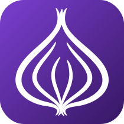

 

<picture>
  <source media="(prefers-color-scheme: dark)" srcset="brand/wordmark-white.svg" />
  
</picture>

 

  
  
  
  
  

<a href="https://oignon.dev"><b>oignon.dev</b></a>

https://github.com/user-attachments/assets/8f1f5374-8f4c-4fc3-b607-357ea4220e17

## Features

- **Readable citation graphs.** Chronological citation graphs showing research lineage both backwards and forwards in time.
- **Bibliography import.** Paste a `.bbl`/BibTeX file or a list of DOIs and build a graph of the literature in the way that suits your workflow best.
- **Shareable graphs.** Easily share interesting work with your colleagues.
- **Open and safe.** Free to use, built on the [OpenAlex](https://openalex.org) dataset, and runs entirely in your browser.
- **MCP-ready.** Drive LLM workflows with the [mcp server](https://github.com/hballington12/mcp-oignon) and make hallucinated papers a thing of the past.

## Cite

Paper citation graph visualization. Please consider citing the paper if you found this tool useful:

> H. Ballington, "Oignon: Citation Graph Tool," arXiv:2512.22159 [cs.DL], 2025. Available: https://arxiv.org/abs/2512.22159

## MCP

Get the [mcp server](https://github.com/hballington12/mcp-oignon) for LLM-assisted workflows.

## License and brand

The code is open source under the [MIT License](LICENSE).

The oignon name and logo are not covered by the license and are reserved (© 2025 Harry Ballington). See [TRADEMARK.md](TRADEMARK.md).

See [PRIVACY.md](PRIVACY.md) for the privacy policy.
